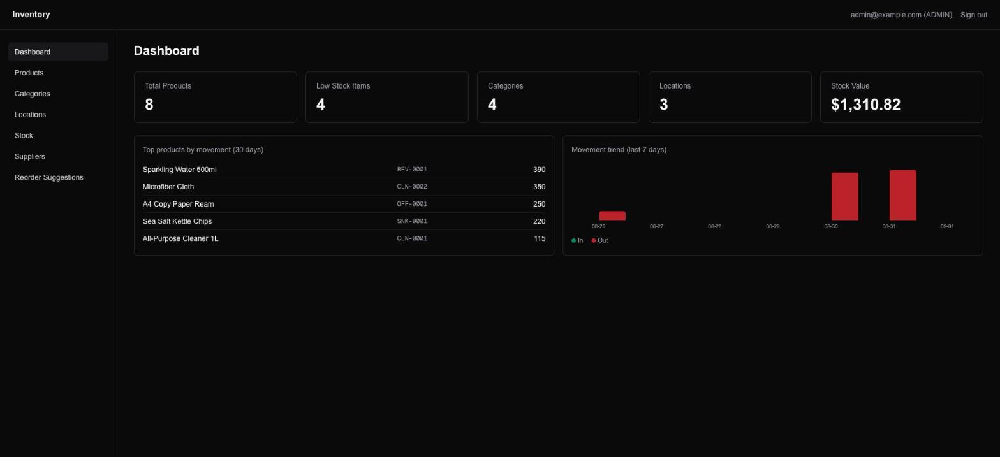
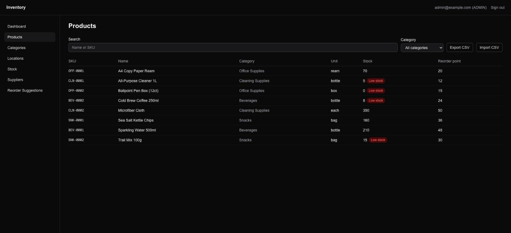
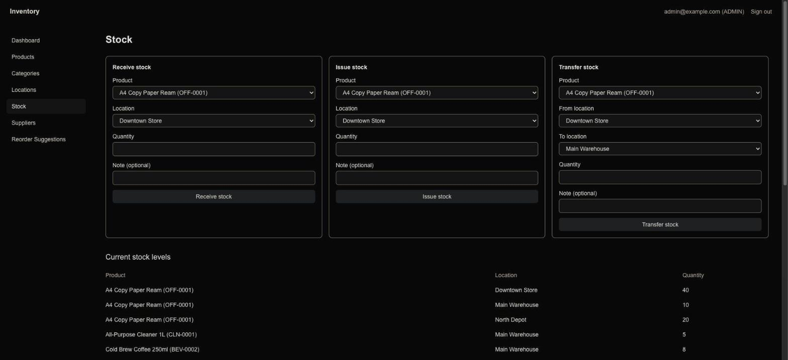
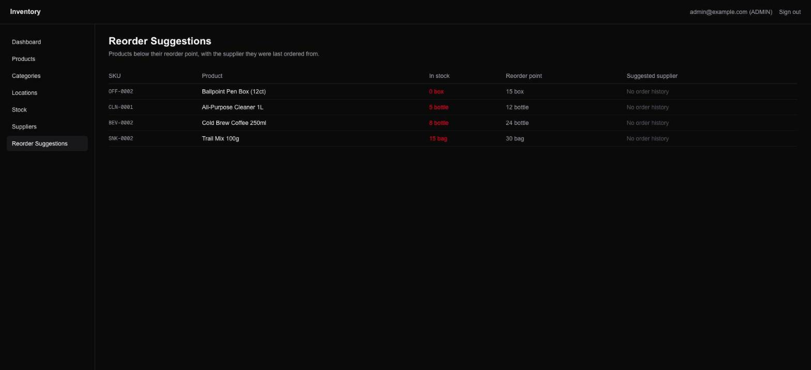

# Inventory Management

[](https://github.com/yudhvir01/inventory-management/actions/workflows/ci.yml)

A multi-location inventory management system built with Next.js, Prisma, and
PostgreSQL — products, categories, stock levels across locations, and
race-safe stock-in/out/transfer transactions with a full audit trail.

**Live demo:** https://inventory-management-three-black.vercel.app
(demo credentials: `admin@example.com` / `admin1234`)

Built incrementally as a portfolio project — see [ROADMAP.md](./ROADMAP.md)
for the planned phases and [PROGRESS.md](./PROGRESS.md) for a running log of
what's been built and when.

## Features

- **Auth & roles** — credentials-based login via Auth.js (NextAuth v5),
  bcrypt-hashed passwords, JWT sessions. `ADMIN`/`STAFF` roles gate
  destructive operations (create/edit/delete on products, categories, and
  locations are ADMIN-only; stock operations are open to any authenticated
  user).
- **Products & categories** — full CRUD with SKU uniqueness, reorder points,
  and category assignment; searchable, filterable, paginated product list.
- **Multi-location stock** — per-product, per-location quantity tracking.
- **Stock transactions** — receive (stock-in), issue (stock-out), and
  transfer-between-locations flows, each atomic and race-safe: concurrent
  stock-out requests can't oversell, enforced via a conditional `updateMany`
  inside a database transaction rather than a read-then-write check.
- **Audit log** — every stock movement is recorded as a `StockTransaction`
  (type, quantity, who, when), viewable per-product on the product detail
  page.

## Tech stack

- [Next.js](https://nextjs.org) 16 (App Router, Turbopack) + TypeScript
- [Tailwind CSS](https://tailwindcss.com) 4
- [Prisma](https://prisma.io) 7 + PostgreSQL (via `@prisma/adapter-pg`)
- [Auth.js / NextAuth](https://authjs.dev) v5 (credentials provider)

## Getting started

Requires Node.js and a PostgreSQL database.

```bash
npm install
cp .env.example .env   # fill in DATABASE_URL and AUTH_SECRET
npx prisma migrate dev
npm run db:seed        # optional: demo users, categories, products
npm run dev
```

Open [http://localhost:3000](http://localhost:3000).

### Environment variables

| Variable       | Description                                              |
| -------------- | ---------------------------------------------------------- |
| `DATABASE_URL` | PostgreSQL connection string.                             |
| `AUTH_SECRET`  | Secret used by Auth.js to sign session tokens. Generate with `openssl rand -base64 32`. |

## Scripts

| Command            | Description                          |
| ------------------- | ------------------------------------- |
| `npm run dev`       | Start the dev server (Turbopack).     |
| `npm run build`     | Production build.                     |
| `npm run start`     | Run the production build.             |
| `npm run lint`      | Lint the codebase.                    |
| `npm test`          | Run the unit test suite (Vitest).     |
| `npm run db:seed`   | Seed the database with demo data.     |

## Testing

`npm test` runs the Vitest suite: unit tests for every core flow's
business/validation logic — stock-in/out/transfer quantity and shape
validation, purchase-order status transitions and receiving preconditions,
CSV parsing/import, and the `requireAdmin` authorization check. These don't
require a database. Route-level tests that exercise the actual API handlers
against a real Postgres instance aren't part of this suite yet.

CI (`.github/workflows/ci.yml`) runs `prisma generate`, lint, `tsc --noEmit`,
and this test suite on every push and pull request to `main`. It doesn't run
`next build`, since that prerenders pages that query the database and CI has
no `DATABASE_URL` to give it — a full build is left to the deploy platform.

## Deployment

Targets [Vercel](https://vercel.com) for hosting and [Neon](https://neon.tech)
for a hosted PostgreSQL database, though any Postgres provider works.

1. Create a Neon (or other Postgres) database and copy its connection string.
2. Import the repo into Vercel. Framework preset: Next.js (auto-detected);
   build command and output are left at their defaults.
3. Set these environment variables in the Vercel project settings
   (Production, and Preview if you want preview deploys to hit a database
   too):

   | Variable       | Notes                                                        |
   | -------------- | ------------------------------------------------------------ |
   | `DATABASE_URL` | The Neon (or other Postgres) connection string.               |
   | `AUTH_SECRET`  | Generate with `openssl rand -base64 32`. Required in production. |
   | `SMTP_HOST`, `SMTP_PORT`, `SMTP_USER`, `SMTP_PASS`, `SMTP_FROM` | Optional — low-stock alert emails log to the console instead of sending if `SMTP_HOST` is unset. |
   | `ALERT_EMAIL_TO` | Recipient for `POST /api/alerts/low-stock/notify`. Required only if that endpoint is used. |

4. Apply the migration history to the production database once, from a
   machine with `DATABASE_URL` pointed at it:

   ```bash
   npx prisma migrate deploy
   npm run db:seed   # optional: demo data, skip for a real deployment
   ```

5. Deploy. `GET /api/health` returns `{"status":"ok"}` with a 200 once the
   app can reach the database, and `503` otherwise — point an uptime
   monitor or Vercel's health check at it. If `DATABASE_URL` or
   `AUTH_SECRET` is missing in production, the app fails fast at startup
   with an error naming exactly what's missing, rather than surfacing as a
   confusing runtime error on first request.

## Screenshots

Captured from the live Vercel deployment backed by a real Neon Postgres
database.

**Dashboard** — stock value, low-stock count, top-moved products, and a
7-day movement trend.



**Products** — searchable/filterable list with low-stock badges and CSV
export/import.



**Stock** — receive, issue, and transfer stock across locations, with
current stock levels below.



**Reorder Suggestions** — products below their reorder point.



## Project structure

```
src/
  app/            # App Router routes, API routes, server actions
  components/     # Client/server React components
  lib/            # Prisma client, auth helpers, env validation, business logic
  auth.ts         # Auth.js configuration
  proxy.ts        # Route protection (Next.js 16's replacement for middleware.ts)
prisma/
  schema.prisma   # Data model
  migrations/     # Migration history
  seed.ts         # Demo data seed script
.github/workflows/
  ci.yml          # Lint/typecheck/test on every push and PR to main
```
